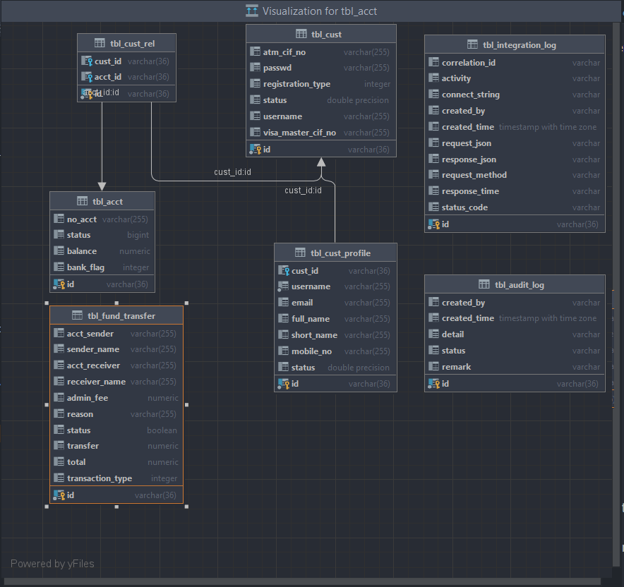

Danamon Backend Fund Transfer

Stack yang digunakan :
1. Java (version 18)
2. Postgresql
3. swagger UI
4. Flyway migration
5. message queue (soon)
6. redis 
7. Logging
8. unit test 
9. docker (soon)

Tabel pada Postgresql : 
1. tbl_cust
2. tbl_cust_profile
3. tbl_cust_rel
4. tbl_acct
5. tbl_fund_transfer
6. tbl_integration_log
7. tbl_audit_log (soon)

Relasi Antar DB : 

Function atau store procedure : 
1. get_data_cust (untuk melihat data customer)
2. get_data_fund_transfer (Untuk melihat data transaksi nasabah seperti pada IBBO (soon))

Flow :
Add Customer :
1. add customer terlebih dahulu pada postman terlampir (data akan bertambah di tbl_cust dan tbl_cust_profile)
    keterangan :
    - registration_type == 1 (atm_cif_no)
    - registratio_type == 2 (visa_master_cif_no)
2. Setelah data customer berhasil data rekening akan bertambah secara otomatis di tbl_acct dengan relasi dengan tbl_cust_rel

Fund Transfer : 
1. api "fund-transfer" seperti pada postman terlampir dengan catatan
    keterangan : 
    - jumlah length nomor rekening ini default 8 (jika length > 8 maka dianggap rekening bank lain)
    - jika transaction type == 1 (transaksi ke sesama bank tidak dikenakan admin_fee (0))
    - jika transactio type == 2 (transaksi ke bank lain dikenakan admin_fee (6500))

Semua activity tercatat di tbl_integration_log dan untuk detail transaksi di tbl_audit_log (namun masih tahap on develop)
    

